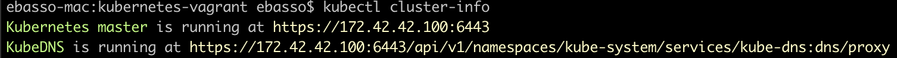

Kubernetes Cluster in VirtualBox using Vagrant and CentOS
=============================


In this example, i configured a Kubernetes cluster using kubeadm, by creating 3 Virtualbox nodes, each node running CentOS (master, node1, node2). 

Each virtualbox virtual machine is configured using 'Bridge' networking. As a result, I have the following setup:

* Master node **master.k8s.com** running at 172.42.42.100 (virtualbox)
* Worker node 1 **node1.k8s.com** running at 172.42.42.101 (virtualbox)
* Worker node 2 **node2.k8s.com** running at 172.42.42.102 (virtualbox)


# Setup Environment

Install dependencies

* VirtualBox 6.1 or greater.
* Vagrant 2.2.9 or greater.
* Kubectl 1.18.x or greater.

Clone this project and get it running!

```
git clone https://github.com/ebasso/kubernetes-vagrant.git

cd kubernetes-vagrant
```

Startup the deploy

```
vagrant up
```

# First Steps

Connect to master host using vagrant

```
vagrant ssh master
```

Verifying Kubernetes cluster

```
[vagrant@master ~]$ kubectl get nodes -o wide

NAME             STATUS   ROLES    AGE   VERSION   INTERNAL-IP     EXTERNAL-IP   OS-IMAGE                KERNEL-VERSION              CONTAINER-RUNTIME
master.k8s.com   Ready    master   109m   v1.18.3   172.42.42.100   <none>        CentOS Linux 7 (Core)   3.10.0-862.2.3.el7.x86_64   docker://19.3.11
node1.k8s.com    Ready    <none>   102m   v1.18.3   172.42.42.101   <none>        CentOS Linux 7 (Core)   3.10.0-862.2.3.el7.x86_64   docker://19.3.11
node2.k8s.com    Ready    <none>   93m    v1.18.3   172.42.42.102   <none>        CentOS Linux 7 (Core)   3.10.0-862.2.3.el7.x86_64   docker://19.3.11
```

Verifying Pods

```
[vagrant@master ~]$ kubectl get pods --all-namespaces
```

Verifying Kubernetes cluster

```
[vagrant@master ~]$ kubectl cluster-info

Kubernetes master is running at https://172.42.42.100:6443
KubeDNS is running at https://172.42.42.100:6443/api/v1/namespaces/kube-system/services/kube-dns:dns/proxy

To further debug and diagnose cluster problems, use 'kubectl cluster-info dump'.
```

# Accessing services running in the cluster from host machine

Now I would like to access services running in the cluster from my host machine (the physical machine where the virtualbox nodes are running).

Create the configuration directory
```
$ mkdir -p ~/.kube
```

Find the SSH port of the master

```
$ vagrant port master

The forwarded ports for the machine are listed below. Please note that
these values may differ from values configured in the Vagrantfile if the
provider supports automatic port collision detection and resolution.

    22 (guest) => 2222 (host)
```


Copy the file using scp (ssh password is vagrant)
```
scp -P 2222 vagrant@127.0.0.1:/home/vagrant/.kube/config ~/.kube/config
```

Get Cluster info again

```
kubectl cluster-info
```



# Another tasks

* [Deploy Kubernetes Dashboard](readme/deploy-kubernetes-dashboard.md)

# Examples

* [Example 1: Deploy Nginx](readme/example1-deploy-nginx.md)


## License

[Apache License 2.0](LICENSE)
