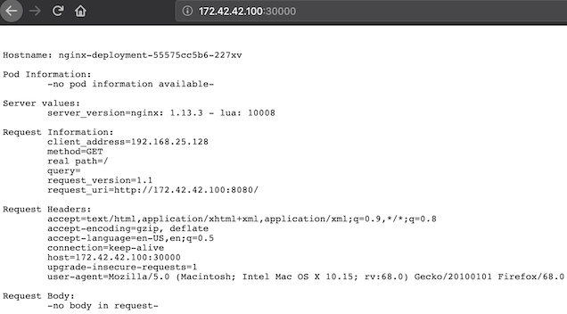

The following example deploys 3 replicas of an echo server running nginx and publishes the http port using a NodePort:


```
$ kubectl apply -f yamls/example1-deploy-nginx.yaml
```

Check if pods are ready

```
$ kubectl get pods

NAME                                READY   STATUS    RESTARTS   AGE
nginx-deployment-55575cc5b6-227xv   1/1     Running   0          108s
nginx-deployment-55575cc5b6-gn795   1/1     Running   0          108s
nginx-deployment-55575cc5b6-mb8z7   1/1     Running   0          108s
```

Checking service

```
$ kubectl get svc

NAME                       TYPE        CLUSTER-IP      EXTERNAL-IP   PORT(S)          AGE
service/kubernetes         ClusterIP   10.96.0.1       <none>        443/TCP          15m
service/nginx-service-np   NodePort    10.110.17.111   <none>        8082:30000/TCP   2m2s
```

Our nginx servers was exposed at port **30000**.


In a browser, you can access through the adresses:

* https://172.42.42.100:30000
* https://172.42.42.101:30000
* https://172.42.42.102:30000

The result is below:



Or you use curl:

```
$ curl http://172.42.42.101:30000/


Hostname: nginx-deployment-55575cc5b6-227xv

Pod Information:
	-no pod information available-

Server values:
	server_version=nginx: 1.13.3 - lua: 10008

Request Information:
	client_address=192.168.248.0
	method=GET
	real path=/
	query=
	request_version=1.1
	request_uri=http://172.42.42.101:8080/

Request Headers:
	accept=*/*
	host=172.42.42.101:30000
	user-agent=curl/7.64.1

Request Body:
	-no body in request-v
```


